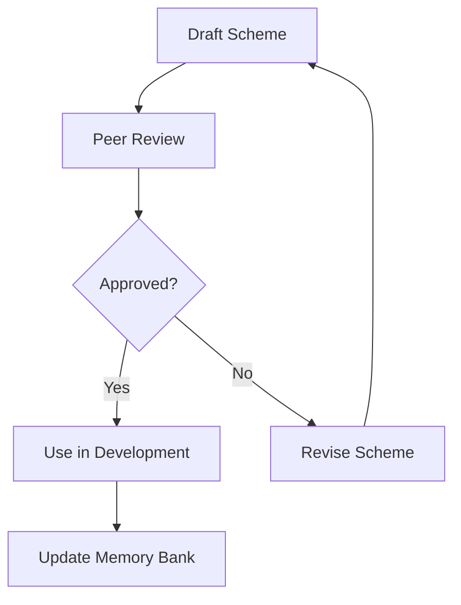

# MEMORY BANK SYSTEM SCHEME MANAGEMENT

## Overview
System schemes describe the architecture of the product at two detail levels:

* **C1** – the product is a black box. The scheme lists external systems and the protocols used to communicate with them.
* **C2** – expands the black box into its internal service components, showing protocols between them and connections to the same external black boxes.

Both scheme levels help coordinate planning and design.
Record each scheme's file path in `tasks.md` so every workflow phase can load the appropriate diagram.

## \ud83d\udcc1 System Scheme Template
| Field | Description |
|-------|-------------|
| **Product/Context Name** | Name of the system or capability |
| **Purpose** | What this system does |
| **External Systems** | Other black boxes that interact with it |
| **Protocols** | HTTP, gRPC, messaging, etc. |
| **Internal Capabilities** | Optional list of key services or contexts |
| **Data Stores** | Databases or persistence layers |
| **Diagram** | Mermaid diagram code describing the scheme |
| **Notes** | Additional context |

Schemes must be defined using Mermaid so the diagram code can be stored directly in the repository and versioned like other documents.

C2 schemes expand **Internal Capabilities** into explicit components and list the protocols between them.

## \ud83d\uddd3\ufe0f Scheme Lifecycle

## \ud83d\uddc2 Storage Conventions
Store the C1 scheme under `memory-bank/system-schemes/c1.md`.
Store the C2 scheme under `memory-bank/system-schemes/c2.md`.
Update `memory-bank/system-schemes/index.md` on every addition.

## \ud83d\udca1 Checklist
* [ ] Scheme captures purpose and interfaces
* [ ] Diagram included if useful
* [ ] Peer review finished
* [ ] Linked from relevant tasks
