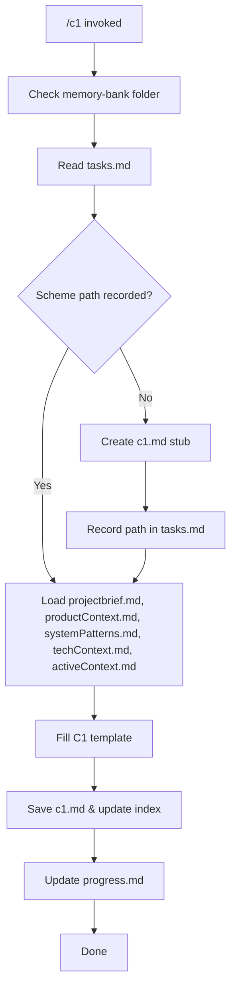

# MEMORY BANK SYSTEM SCHEME C1 PROMPT

Create or update a system-level scheme that treats the product as a black box and shows interactions with external systems. Follow the template from `system-scheme-management.md`. Save it under `memory-bank/system-schemes/c1.md`.

## Process Overview

