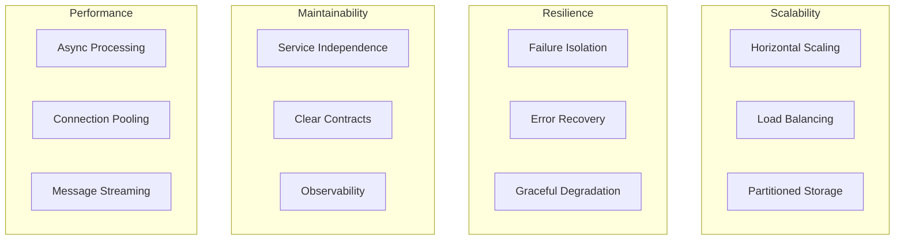

# System Architecture Understanding Scenario

## Actor
**Software Architect** - A system architect studying microservices patterns and distributed system design

## Touchpoint
**Documentation & Monitoring Tools** - Architecture diagrams, system documentation, Kafka UI, and service logs

## Story
*As a software architect, I want to understand the complete system architecture and data flow patterns so that I can evaluate the design decisions, identify scalability considerations, and learn how to implement similar event-driven microservices systems.*

## Steps

### 1. System Overview Analysis
- Review system architecture diagram in `memory-bank/system-schemes/c1.md`
- Study component breakdown in `memory-bank/system-schemes/c2.md`
- Examine service boundaries and responsibilities
- Understand technology choices and their rationale

### 2. Service Architecture Deep Dive
- **Order Service Analysis**:
  - Review REST API design in Swagger: http://localhost:5001/swagger
  - Examine domain models: Order, OrderItem entities
  - Study event publishing patterns: OrderCreated event
  - Analyze database schema and relationships

- **Inventory Service Analysis**:
  - Review inventory management API: http://localhost:5002/swagger
  - Examine inventory reservation logic
  - Study event consumption patterns: OrderCreated → InventoryReserved
  - Analyze stock level persistence and updates

- **Notification Service Analysis**:
  - Review notification API: http://localhost:5003/swagger
  - Examine multi-event consumption patterns
  - Study notification generation and storage
  - Analyze customer communication strategies

### 3. Event Flow Architecture Analysis
- Access Kafka UI: http://localhost:8080
- Examine topic structure: `order-created`, `inventory-reserved`
- Study event schemas and message formats
- Analyze consumer group configurations
- Review event ordering and delivery guarantees

### 4. Data Architecture Evaluation
- **Database per Service Pattern**:
  - Order Service: Orders and OrderItems tables
  - Inventory Service: Inventory table with product quantities  
  - Notification Service: Notifications table with customer messages
- **Data Consistency Strategy**:
  - No cross-service database access
  - Eventual consistency through event propagation
  - Event sourcing for audit trails

### 5. Infrastructure Architecture Assessment
- **Containerization Strategy**:
  - Review `docker-compose.yml` configuration
  - Analyze service dependencies and startup ordering
  - Examine port mapping and network configuration
- **Service Discovery**:
  - Container-based service location
  - Environment-specific configuration management
  - Health check and monitoring strategies

## Acceptance Criteria

### Architecture Understanding Criteria
- ✅ Can explain the purpose and responsibilities of each microservice
- ✅ Understands event-driven communication patterns vs synchronous calls
- ✅ Can identify service boundaries and data ownership principles
- ✅ Comprehends the database-per-service pattern implementation

### Design Pattern Recognition Criteria
- ✅ Recognizes publish-subscribe pattern in Kafka event flow
- ✅ Identifies eventual consistency strategy across services
- ✅ Understands compensating actions for distributed transactions
- ✅ Can explain the benefits of service isolation and loose coupling

### Scalability Assessment Criteria
- ✅ Can identify horizontal scaling opportunities for each service
- ✅ Understands Kafka's role in handling high-throughput scenarios
- ✅ Recognizes database partitioning and performance considerations
- ✅ Can evaluate service deployment and resource allocation strategies

### Technology Evaluation Criteria
- ✅ Understands why .NET 9 was chosen for service implementation
- ✅ Can explain Kafka's advantages over other messaging solutions
- ✅ Recognizes PostgreSQL's role in providing ACID properties
- ✅ Understands Docker's benefits for development and deployment

## Protocols / Services

### Architecture Layers
1. **Presentation Layer**: REST APIs with Swagger documentation
2. **Business Logic Layer**: Service classes with domain logic
3. **Messaging Layer**: Kafka event streaming and processing
4. **Data Access Layer**: Entity Framework with PostgreSQL
5. **Infrastructure Layer**: Docker containers and orchestration

### Communication Patterns
- **Synchronous**: HTTP REST for client-to-service communication
- **Asynchronous**: Kafka events for service-to-service communication
- **Data Access**: Entity Framework ORM for database operations
- **Configuration**: Environment variables and appsettings.json

### Quality Attributes

## Notes

### Design Strengths
- **Clear Service Boundaries**: Each service has well-defined responsibilities
- **Loose Coupling**: Services interact only through events, not direct calls
- **Technology Consistency**: .NET 9 ecosystem provides unified development experience
- **Event Sourcing**: Complete audit trail of business events
- **Container-Ready**: Docker configuration enables easy deployment scaling

### Architectural Trade-offs
- **Eventual Consistency**: Data may be temporarily inconsistent across services
- **Complexity**: Distributed system complexity vs monolithic simplicity
- **Network Latency**: Async communication adds latency vs in-process calls
- **Testing Challenges**: Integration testing across multiple services required

### Scalability Considerations
- **Service Scaling**: Each service can scale independently based on load
- **Kafka Partitioning**: Topics can be partitioned for parallel processing
- **Database Scaling**: Read replicas and sharding strategies available
- **Container Orchestration**: Kubernetes-ready for production scaling

### Future Architecture Evolution
- **API Gateway**: Centralized routing and authentication
- **Service Mesh**: Advanced traffic management and security
- **CQRS Implementation**: Separate read/write models for optimization
- **Event Sourcing Enhancement**: Complete event store with replay capabilities

### Learning Resources
- **Documentation**: Comprehensive Memory Bank files for reference
- **Demo Scripts**: Automated workflows for architecture validation
- **Monitoring Tools**: Kafka UI and container logs for runtime analysis
- **Code Examples**: Well-documented service implementations for study

### Comparison with Other Patterns
- **vs Monolithic**: Better scalability and technology diversity, higher complexity
- **vs SOA**: Lighter weight services, event-driven vs service-oriented
- **vs Serverless**: More control over infrastructure, persistent services
- **vs Message Queues**: Event streaming vs point-to-point messaging
