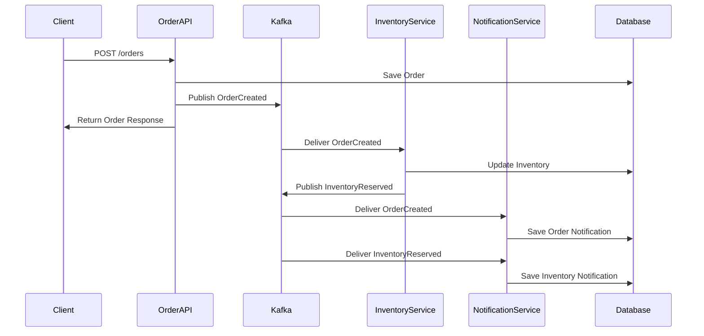

# Order Processing Workflow Scenario

## Actor
**Developer** - A software developer learning microservices patterns and event-driven architecture

## Touchpoint  
**REST API** - Using HTTP clients (Postman, curl, PowerShell scripts) to interact with service endpoints

## Story
*As a developer, I want to understand the complete order processing workflow so that I can learn how microservices communicate through events and see the practical implementation of event-driven architecture.*

## Steps

### 1. System Setup and Verification
- Start Docker containers: `docker-compose up --build -d`
- Verify all services are running: `docker-compose ps`
- Check service health via Swagger UIs:
  - Order Service: http://localhost:5001/swagger
  - Inventory Service: http://localhost:5002/swagger  
  - Notification Service: http://localhost:5003/swagger
- Access Kafka UI: http://localhost:8080

### 2. Check Initial State
- **GET** `http://localhost:5002/api/inventory/PROD001` - Check initial inventory
- **GET** `http://localhost:5003/api/notifications/CUSTOMER_001` - Verify no existing notifications

### 3. Create Order (Trigger Event Chain)
- **POST** `http://localhost:5001/api/orders`
```json
{
  "customerId": "CUSTOMER_001",
  "items": [
    {
      "productId": "PROD001",
      "productName": "Gaming Laptop",
      "quantity": 1,
      "unitPrice": 1299.99
    },
    {
      "productId": "PROD002", 
      "productName": "Wireless Mouse",
      "quantity": 2,
      "unitPrice": 49.99
    }
  ]
}
```

### 4. Observe Event Processing
- Monitor Kafka topics in Kafka UI (http://localhost:8080)
- Check order status: **GET** `http://localhost:5001/api/orders/{orderId}`
- Verify inventory changes: **GET** `http://localhost:5002/api/inventory/PROD001`
- Check notifications: **GET** `http://localhost:5003/api/notifications/CUSTOMER_001`

### 5. Validate End-to-End Workflow
- Confirm order is created with correct total amount
- Verify inventory quantities are reduced
- Validate customer notifications are created
- Review logs in Docker containers for event processing

## Acceptance Criteria

### Order Service Criteria
- ✅ Order is persisted to database with correct customer ID and items
- ✅ Order total is calculated correctly from item prices and quantities
- ✅ OrderCreated event is published to Kafka topic `order-created`
- ✅ Order status is returned in API response

### Inventory Service Criteria  
- ✅ OrderCreated event is consumed from Kafka
- ✅ Inventory quantities are reduced for ordered products
- ✅ InventoryReserved event is published to Kafka topic `inventory-reserved`
- ✅ Updated inventory levels are returned via API

### Notification Service Criteria
- ✅ OrderCreated event triggers order confirmation notification
- ✅ InventoryReserved event triggers inventory status notification  
- ✅ Notifications are persisted with customer ID, message, and timestamp
- ✅ Notifications are retrievable via API for specific customer

### System Integration Criteria
- ✅ All events flow through Kafka message broker
- ✅ Services remain decoupled (no direct service-to-service calls)
- ✅ Data consistency is maintained across service boundaries
- ✅ Complete workflow executes within reasonable time (< 5 seconds)

## Protocols / Services

### Service Interactions
1. **HTTP REST** → Order Service API (synchronous)
2. **Kafka Event Publishing** → Order Service to Kafka Broker
3. **Kafka Event Consumption** → Inventory Service from Kafka  
4. **HTTP REST** → Inventory Service internal database operations
5. **Kafka Event Publishing** → Inventory Service to Kafka Broker
6. **Kafka Event Consumption** → Notification Service from Kafka (multiple topics)
7. **HTTP REST** → Notification Service API for retrieval

### Data Flow Sequence


## Notes

### Current Implementation Status
- ⚠️ **Kafka consumers are currently in simulation mode** - Events are logged but not processed through actual Kafka connections
- ✅ **REST APIs are fully functional** - All CRUD operations work as expected
- ✅ **Database persistence works** - Orders, inventory, and notifications are properly stored
- ✅ **Event publishing is implemented** - Services generate correct event payloads

### Learning Objectives Achieved
- **Event-Driven Architecture**: See how services communicate through events rather than direct calls
- **Service Isolation**: Understand how each service owns its data and responsibilities  
- **Asynchronous Processing**: Learn how events enable non-blocking workflows
- **Microservices Patterns**: Experience database-per-service and event sourcing patterns

### Demo Script Available
- Use `.\scripts\complete-notification-demo.ps1` for automated demonstration
- Use `.\scripts\notification-examples.ps1` for focused notification testing
- Manual API testing via Swagger UIs for detailed exploration

### Extension Opportunities
- Add more complex order scenarios (multiple customers, bulk orders)
- Implement order cancellation workflow with compensating events
- Add inventory shortage handling and backorder notifications
- Integrate with actual Kafka consumers for real-time event processing
