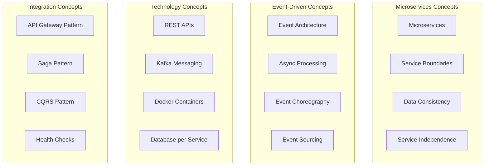

# Learning Microservices Through Demo Scenario

## Actor
**Student** - A computer science student or bootcamp participant learning modern software architecture patterns

## Touchpoint
**Demo Scripts & Interactive Tools** - PowerShell scripts, Swagger UIs, Kafka monitoring, and hands-on exploration

## Story
*As a student, I want to learn microservices and event-driven architecture through hands-on demos so that I can understand how modern distributed systems work and prepare for real-world software development.*

## Steps

### 1. Environment Setup and First Run
- Clone the repository and navigate to project directory
- Start the complete system: `docker-compose up --build -d`
- Wait for all services to become healthy (check `docker-compose ps`)
- Verify you can access all service endpoints:
  - Order Service: http://localhost:5001/swagger
  - Inventory Service: http://localhost:5002/swagger
  - Notification Service: http://localhost:5003/swagger
  - Kafka UI: http://localhost:8080

### 2. Run Your First Demo
- Execute: `.\scripts\simple-notification-demo.ps1 -CustomerId "STUDENT_001"`
- Observe the output and understand what happened:
  - A test notification was sent directly
  - An order was created through the API
  - Events were published to Kafka
  - Notifications were generated and stored

### 3. Explore Individual Services
- **Understanding Order Service**:
  - Open Swagger UI: http://localhost:5001/swagger
  - Try the GET `/api/orders` endpoint to see existing orders
  - Create a new order using the POST `/api/orders` endpoint
  - Notice how the response includes an order ID and status

- **Understanding Inventory Service**:
  - Open Swagger UI: http://localhost:5002/swagger
  - Check inventory levels: GET `/api/inventory/PROD001`
  - Notice how quantities change after creating orders
  - Understand the product catalog (PROD001-PROD004)

- **Understanding Notification Service**:
  - Open Swagger UI: http://localhost:5003/swagger
  - Retrieve notifications: GET `/api/notifications/STUDENT_001`
  - Send a test notification: POST `/api/notifications/test-order-confirmation`
  - See how notifications accumulate over time

### 4. Explore Event Flow with Kafka UI
- Open Kafka UI: http://localhost:8080
- Navigate to "Topics" section
- Examine the `order-created` topic:
  - Click on the topic name
  - View recent messages
  - Understand the event structure
- Examine the `inventory-reserved` topic similarly
- Notice how events flow between services

### 5. Run Comprehensive Demo
- Execute: `.\scripts\complete-notification-demo.ps1 -CustomerId "STUDENT_002"`
- Follow along with the detailed output explanations
- Understand the difference between:
  - Direct API calls (immediate response)
  - Event-driven processing (asynchronous)
  - Simulated vs real Kafka processing

### 6. Experiment and Learn
- Try different scenarios:
  - Multiple orders for the same customer
  - Orders with different product combinations
  - Large quantity orders to see inventory depletion
- Compare API responses before and after operations
- Watch how notifications accumulate for customers

## Acceptance Criteria

### Basic Understanding Criteria
- ✅ Can explain what a microservice is and identify the three services
- ✅ Understands the difference between REST APIs and event messaging
- ✅ Can describe what happens when an order is created
- ✅ Recognizes how services communicate without direct calls

### Hands-On Experience Criteria
- ✅ Successfully runs all demo scripts without errors
- ✅ Can navigate and use all three Swagger UIs
- ✅ Can create orders and check results across services
- ✅ Can access and interpret Kafka UI information

### Event-Driven Architecture Criteria
- ✅ Understands how OrderCreated events trigger inventory changes
- ✅ Can explain how notifications are generated from multiple events
- ✅ Recognizes the asynchronous nature of event processing
- ✅ Understands eventual consistency across services

### Practical Skills Criteria
- ✅ Can modify demo scripts to test different scenarios
- ✅ Can read and interpret service logs using `docker logs`
- ✅ Can troubleshoot basic issues (services not starting, API errors)
- ✅ Can explain the system to others using proper terminology

## Protocols / Services

### Learning Path Through Services
1. **Start with REST APIs** - Direct service interaction for immediate feedback
2. **Explore Data Models** - Understand orders, inventory, notifications
3. **Observe Event Flow** - See how Kafka connects the services
4. **Analyze Patterns** - Recognize microservices and event-driven design

### Technical Concepts Learned

### Demo Script Learning Progression
1. **simple-notification-demo.ps1** - Basic workflow understanding
2. **notification-examples.ps1** - Multiple customer scenarios
3. **complete-notification-demo.ps1** - Comprehensive system demonstration
4. **Custom experiments** - Student-driven exploration

## Notes

### Learning Objectives
- **Conceptual Understanding**: Microservices vs monolithic architecture
- **Practical Skills**: API testing, container management, event monitoring
- **Design Patterns**: Event-driven architecture, database per service
- **Technology Exposure**: .NET, Kafka, Docker, PostgreSQL ecosystem

### Key Insights to Discover
- **Service Independence**: Each service can be developed and deployed separately
- **Event-Driven Benefits**: Loose coupling, scalability, resilience
- **Data Ownership**: Each service manages its own data completely
- **Async Processing**: Events enable non-blocking, parallel processing

### Common Learning Questions Answered
- **"How do services communicate?"** - Through Kafka events, not direct calls
- **"What happens if a service fails?"** - Other services continue working
- **"How is data kept consistent?"** - Through eventual consistency via events
- **"Why use events instead of API calls?"** - Better scalability and decoupling

### Progression to Advanced Topics
- **After Mastering Basics**: Explore error handling, retry mechanisms
- **Advanced Patterns**: Saga pattern for distributed transactions
- **Production Concerns**: Monitoring, logging, security considerations
- **Scaling Strategies**: Horizontal scaling, load balancing, performance tuning

### Troubleshooting Common Issues
- **Services not starting**: Check Docker Desktop, port conflicts
- **API not responding**: Verify service health, check container logs
- **Events not processing**: Understand simulation mode vs real Kafka
- **Demo script errors**: Check PowerShell execution policy, service availability

### Building on This Knowledge
- **Next Steps**: Implement similar patterns in other languages/frameworks
- **Related Technologies**: Learn about Kubernetes, service meshes, API gateways
- **Career Preparation**: Understand how these patterns apply in enterprise systems
- **Portfolio Projects**: Build your own event-driven microservices system

### Resources for Continued Learning
- **Documentation**: Complete Memory Bank with architectural decisions
- **Code Study**: Well-commented service implementations to examine
- **Extensions**: Ideas for additional features and improvements
- **Community**: Patterns used in real-world microservices systems
