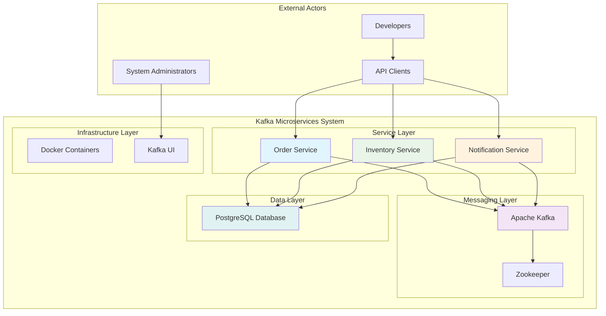
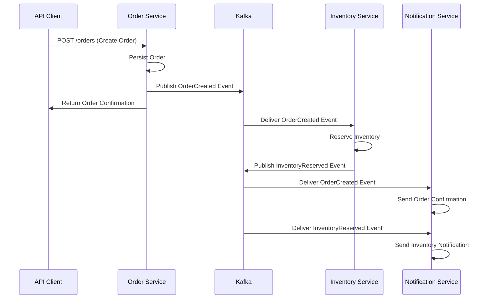

# C1 - System Architecture Overview

## System-Level Architecture

### High-Level System Description

The Kafka Microservices Demo is a distributed event-driven system that demonstrates modern microservices communication patterns using Apache Kafka as the central message broker. The system processes customer orders through multiple autonomous services that communicate asynchronously via published events.

### System Boundaries

### Core System Responsibilities

1. **Order Processing**: Accept and manage customer orders
2. **Inventory Management**: Track and reserve product inventory
3. **Customer Notification**: Send order and inventory updates to customers
4. **Event Coordination**: Ensure reliable message delivery and processing
5. **Data Persistence**: Maintain consistent state across service boundaries

### System Quality Attributes

#### Scalability

- **Horizontal Scaling**: Each service can be independently scaled
- **Message Throughput**: Kafka handles high-volume event streams
- **Database Partitioning**: Service-specific database instances

#### Resilience

- **Service Isolation**: Failure in one service doesn't cascade
- **Message Durability**: Kafka persists events for replay capability
- **Graceful Degradation**: System continues with reduced functionality

#### Maintainability

- **Service Independence**: Services deployed and updated separately
- **Clear Contracts**: Well-defined event schemas and API interfaces
- **Observability**: Comprehensive logging and monitoring

### Event Flow Architecture

### Integration Points

- **North-South**: REST APIs for external client communication
- **East-West**: Kafka events for inter-service communication
- **Data Access**: PostgreSQL for persistent storage
- **Monitoring**: Kafka UI for operational visibility

### Technology Decisions

- **Communication**: Asynchronous messaging over synchronous calls
- **Data Storage**: Database per service pattern
- **Containerization**: Docker for deployment consistency
- **Event Streaming**: Kafka for reliable message delivery

### Deployment Architecture

- **Container Orchestration**: Docker Compose for local development
- **Service Discovery**: Container networking and port mapping
- **Configuration Management**: Environment-based configuration
- **Health Monitoring**: Service health check endpoints
