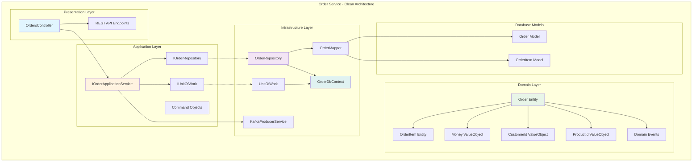
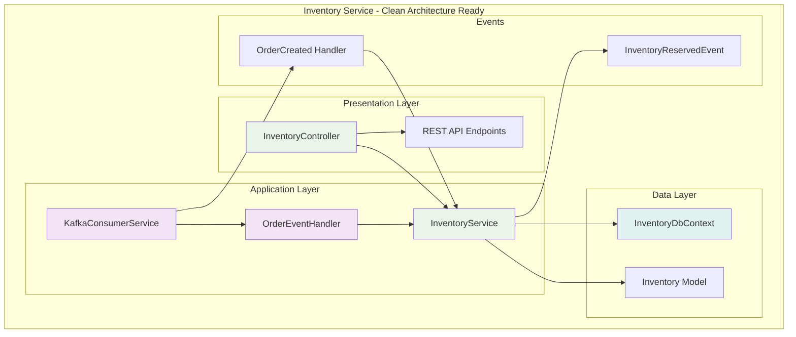
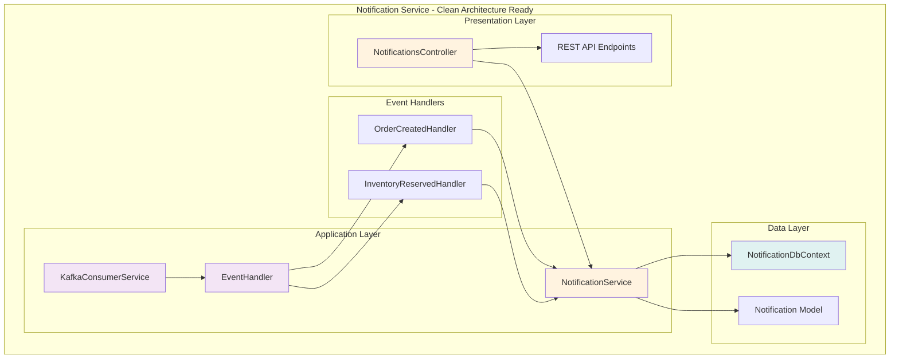
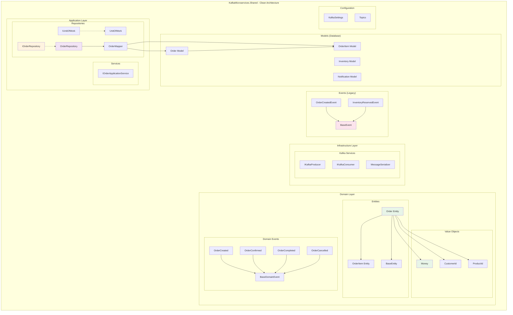
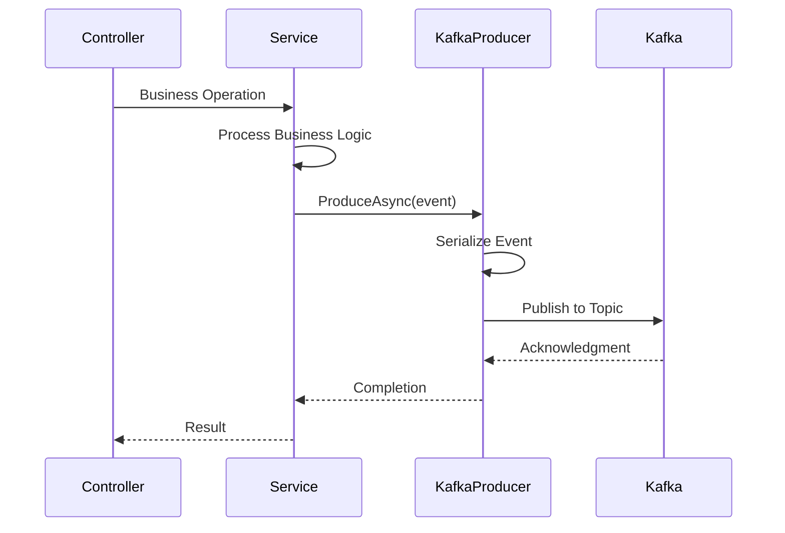
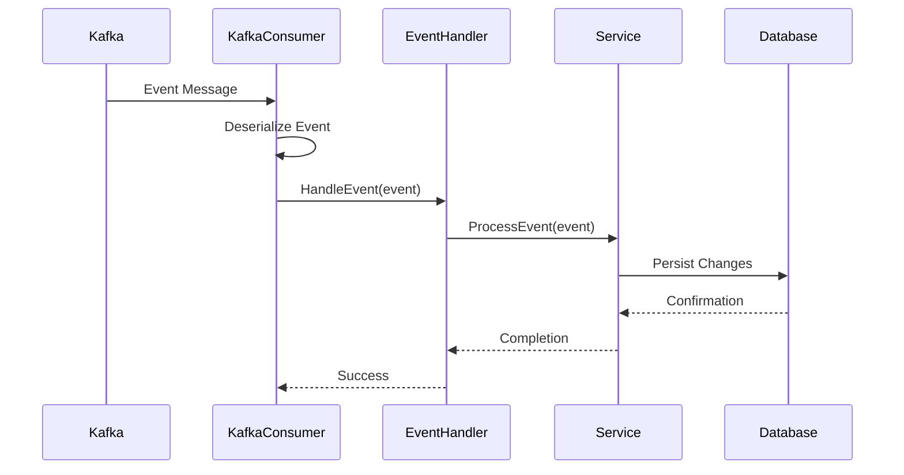

# C2 - Component Architecture Description

**Last Updated**: September 16, 2025  
**Project Status**: Clean Architecture Implementation Complete  
**Architecture Pattern**: Domain-Driven Design with Clean Architecture  
**Current Phase**: Ready for Kafka Integration Enhancement

## Component-Level Architecture

### Clean Architecture Implementation Status

**✅ Completed (September 2025)**:

- Domain Layer with entities, value objects, and domain events
- Application Layer with repository interfaces and command objects  
- Infrastructure Layer with repository implementations and type mapping
- Proper separation of concerns following DDD principles
- Type-safe value objects and strongly-typed domain entities
- Successful build validation with all errors resolved

### Service Component Breakdown

#### Order Service Component

**Responsibilities:**

- **Presentation Layer**: REST API endpoint management and HTTP request/response handling
- **Application Layer**: Order business logic orchestration and external service coordination
- **Domain Layer**: Core business rules, entities, value objects, and domain events
- **Infrastructure Layer**: Data persistence, external service integration, and technical concerns

**Clean Architecture Benefits Achieved:**

- **Dependency Inversion**: Domain layer independent of infrastructure concerns
- **Type Safety**: Value objects prevent primitive obsession and type confusion
- **Testability**: Each layer can be tested independently with proper abstractions
- **Maintainability**: Clear separation of concerns and single responsibility principle

**Key Interfaces:**

- `IOrderApplicationService` - Application service contract for order operations
- `IOrderRepository` - Domain repository abstraction for order persistence
- `IUnitOfWork` - Transaction management abstraction
- `IKafkaProducer<BaseEvent>` - Event publishing interface
- REST endpoints for order operations (`/api/orders`)

**Domain Model:**

- `Order` entity with business logic encapsulation
- `OrderItem` entity for order line items
- `Money` value object for monetary amounts with currency support
- `CustomerId` and `ProductId` value objects for type safety
- Domain events for order lifecycle (`OrderCreated`, `OrderConfirmed`, etc.)

#### Inventory Service Component

**Responsibilities:**

- **Inventory Management**: Track and manage product inventory levels
- **Event Processing**: Consume and handle order-related events from Kafka
- **Reservation Logic**: Reserve inventory for confirmed orders
- **Status Reporting**: Provide inventory status via REST API
- **Data Persistence**: Maintain inventory state in database

**Ready for Clean Architecture**: The Inventory Service is prepared for clean architecture refactoring following the Order Service pattern.

**Key Interfaces:**

- `IInventoryService` - Inventory operations and business logic
- `IKafkaConsumer<BaseEvent>` - Event consumption interface  
- Background service for continuous event processing
- REST endpoints for inventory operations (`/api/inventory`)

**Current Implementation Status:**

- ✅ Basic service structure with event handling
- 🔄 Ready for clean architecture implementation
- 📋 Planned: Domain model extraction and repository pattern

#### Notification Service Component

**Responsibilities:**

- **Multi-Event Processing**: Handle multiple event types (order, inventory) from Kafka
- **Notification Generation**: Create customer notifications based on business events
- **Message Composition**: Format and structure notification messages
- **History Management**: Persist notification history for audit and retry
- **Test Endpoints**: Provide REST API for notification testing and management

**Ready for Clean Architecture**: The Notification Service is prepared for clean architecture refactoring.

**Key Interfaces:**

- `INotificationService` - Notification business logic and operations
- `IKafkaConsumer<BaseEvent>` - Multi-event consumption interface
- Background service for continuous event processing
- REST endpoints for notification operations (`/api/notifications`)

**Current Implementation Status:**

- ✅ Multi-event handler implementation
- ✅ Background service for event processing
- 🔄 Ready for clean architecture implementation
- 📋 Planned: Domain model for notification rules and templates

### Shared Components

#### Shared Library Component - Clean Architecture Foundation

**Responsibilities:**

- **Domain Foundation**: Core business entities, value objects, and domain events shared across services
- **Application Contracts**: Repository and service interfaces for dependency inversion
- **Infrastructure Abstractions**: Kafka integration interfaces and messaging contracts
- **Type Safety**: Value objects and strongly-typed identifiers to prevent errors
- **Clean Architecture Support**: Proper layer separation and dependency management
- **Legacy Event Support**: Maintains backward compatibility with existing event system
- **Data Mapping**: Conversion between domain entities and database models
- **Configuration Management**: Centralized Kafka and application settings

**Clean Architecture Achievements:**

- ✅ **Domain Layer**: Complete with entities, value objects, and domain events
- ✅ **Application Layer**: Repository interfaces and application service contracts
- ✅ **Infrastructure Layer**: Repository implementations with proper mapping
- ✅ **Type Safety**: Money, CustomerId, ProductId value objects implemented
- ✅ **Build Validation**: All compilation errors resolved and build successful

**Migration Strategy:**

- **Phase 1**: ✅ Domain layer foundation (completed)
- **Phase 2**: 🔄 Service-by-service clean architecture adoption
- **Phase 3**: 📋 Legacy event system replacement with domain events
- **Phase 4**: 📋 Full integration testing and validation

### Component Interaction Patterns

#### Event Publishing Pattern

#### Event Consumption Pattern

### Data Flow Architecture

#### Service-Specific Data Stores

- **Order Service Database**: Orders, OrderItems tables
- **Inventory Service Database**: Inventory table with stock levels
- **Notification Service Database**: Notifications table with customer messages

#### Cross-Service Data Consistency

- **Event-Driven Consistency**: Changes propagated via Kafka events
- **No Direct Database Access**: Services only access their own data stores
- **Eventual Consistency**: Data synchronization through event processing

### Component Configuration

#### Environment Configuration

- **Service-Specific**: Each service has its own appsettings.json
- **Kafka Configuration**: Consistent broker settings across services
- **Database Connections**: Service-specific PostgreSQL connections
- **Docker Environment**: Container-specific environment variables

#### Dependency Injection Structure

- **Scoped Services**: Entity Framework DbContext and business services
- **Singleton Services**: Kafka producers/consumers and settings
- **Hosted Services**: Background event processors

### Monitoring and Health Components

#### Health Check Pattern

- **Service Health**: Individual service status endpoints
- **Dependency Health**: Database and Kafka connectivity checks
- **Aggregate Health**: Overall system health reporting

#### Logging Strategy

- **Structured Logging**: JSON format with correlation IDs
- **Service Identification**: Clear service boundaries in logs
- **Event Tracking**: Complete event flow visibility

## Current Implementation Status and Next Steps

### ✅ Completed (September 2025)

**Clean Architecture Foundation:**

- Complete domain layer implementation in Shared library
- Order Service fully migrated to clean architecture
- Repository pattern with proper abstractions
- Value objects for type safety and domain modeling
- Domain events infrastructure ready for integration

**Technical Achievements:**

- All compilation errors resolved
- Type mapping between database and domain models
- Proper dependency inversion with interfaces
- Successful build validation across all services

### 🔄 Current Priority: Kafka Integration Enhancement

**Next Phase Goals:**

- Replace simulation mode with real Kafka consumers
- Implement proper Confluent.Kafka integration
- Add error handling and retry mechanisms for event processing
- Validate end-to-end event processing with clean architecture

### 📋 Planned Enhancements

**Clean Architecture Expansion:**

- Migrate Inventory Service to clean architecture pattern
- Migrate Notification Service to clean architecture pattern
- Implement domain events to replace legacy event system
- Add comprehensive integration testing

**System Improvements:**

- Enhanced monitoring and observability
- Performance optimization and load testing
- Advanced error handling and circuit breaker patterns
- Event sourcing capabilities for audit trails

## Architecture Decision Impact

The clean architecture implementation provides a solid foundation for the upcoming Kafka integration enhancement. The separation of concerns and dependency inversion principles will make the Kafka consumer implementation more testable, maintainable, and resilient.

---
Generated by Copilot
