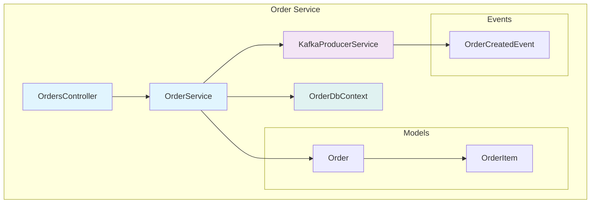
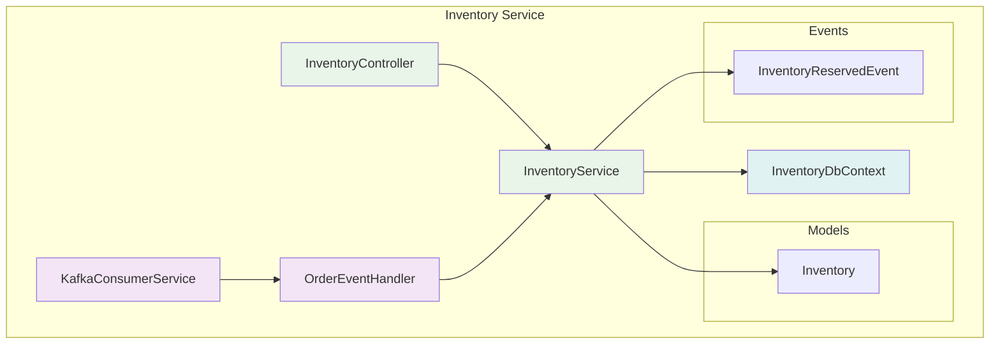
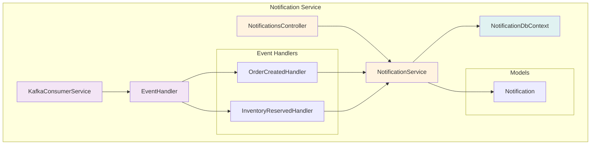
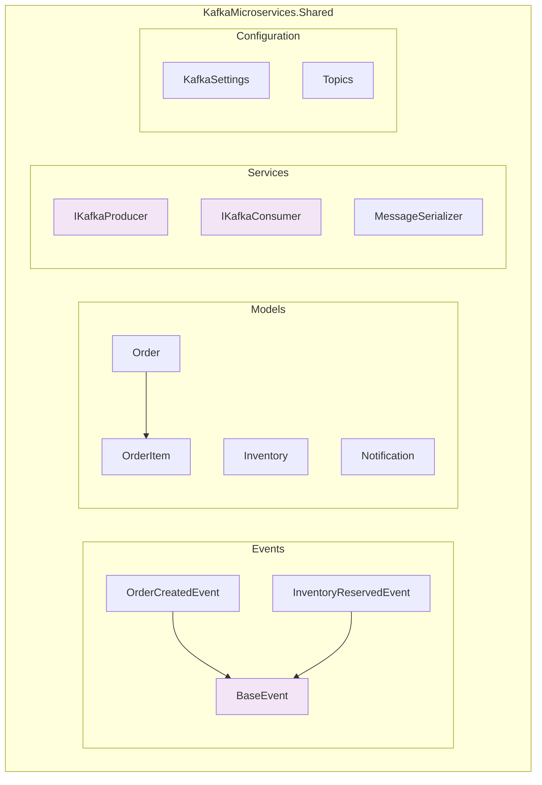
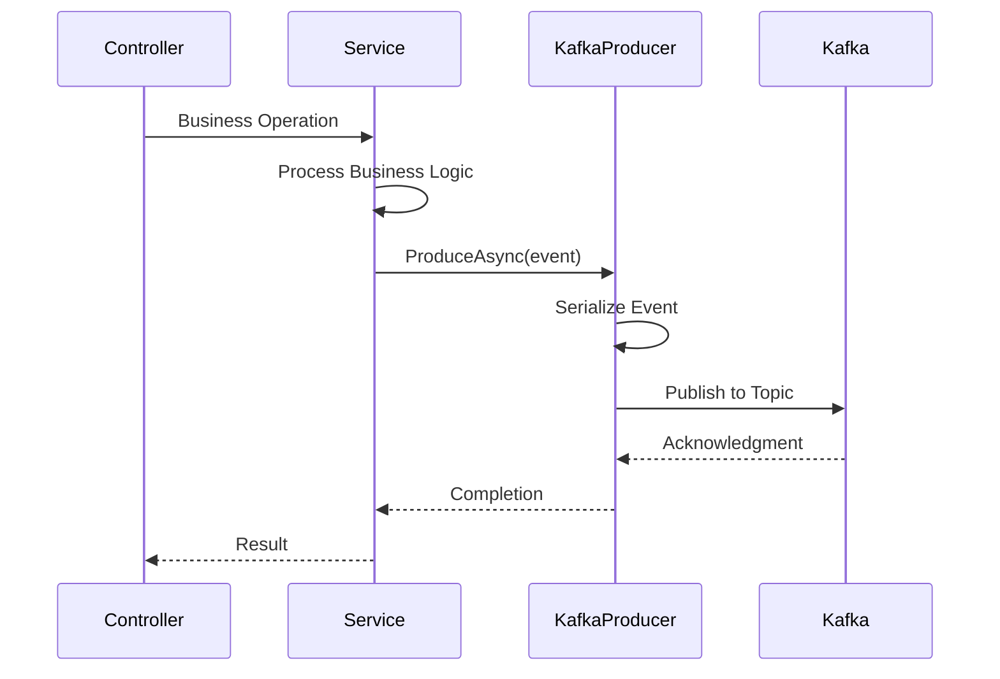
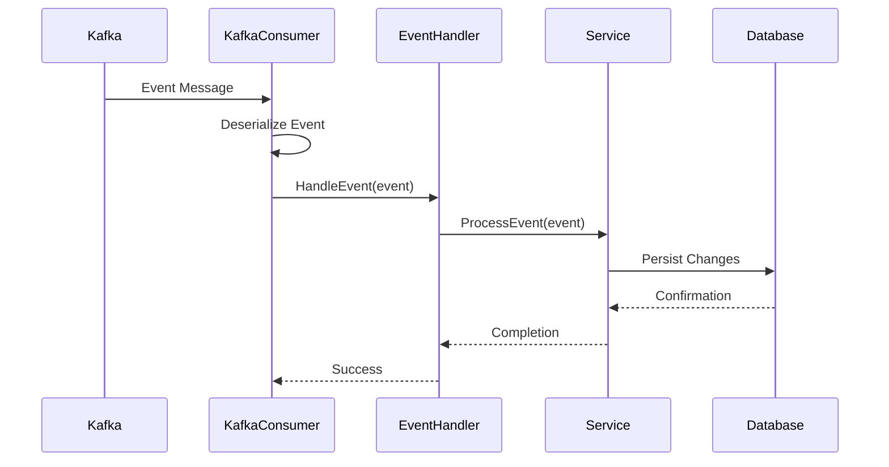

# C2 - Component Architecture Description

## Component-Level Architecture

### Service Component Breakdown

#### Order Service Component

**Responsibilities:**
- REST API endpoint management
- Order business logic processing
- Event publishing to Kafka
- Order data persistence
- Request/response handling and validation

**Key Interfaces:**
- `IOrderService` - Business logic abstraction
- `IKafkaProducer<BaseEvent>` - Event publishing interface
- REST endpoints for order operations

#### Inventory Service Component

**Responsibilities:**
- Inventory level management
- Order event consumption from Kafka
- Inventory reservation processing
- Inventory status reporting
- Stock level persistence

**Key Interfaces:**
- `IInventoryService` - Inventory operations
- `IKafkaConsumer<BaseEvent>` - Event consumption interface
- Background service for event processing

#### Notification Service Component

**Responsibilities:**
- Customer notification management
- Multi-event consumption from Kafka
- Notification message generation
- Notification history persistence
- Test notification endpoints

### Shared Components

#### Shared Library Component

**Responsibilities:**
- Common data models across services
- Event schema definitions
- Kafka integration interfaces
- Message serialization/deserialization
- Shared configuration structures

### Component Interaction Patterns

#### Event Publishing Pattern

#### Event Consumption Pattern

### Data Flow Architecture

#### Service-Specific Data Stores
- **Order Service Database**: Orders, OrderItems tables
- **Inventory Service Database**: Inventory table with stock levels
- **Notification Service Database**: Notifications table with customer messages

#### Cross-Service Data Consistency
- **Event-Driven Consistency**: Changes propagated via Kafka events
- **No Direct Database Access**: Services only access their own data stores
- **Eventual Consistency**: Data synchronization through event processing

### Component Configuration

#### Environment Configuration
- **Service-Specific**: Each service has its own appsettings.json
- **Kafka Configuration**: Consistent broker settings across services
- **Database Connections**: Service-specific PostgreSQL connections
- **Docker Environment**: Container-specific environment variables

#### Dependency Injection Structure
- **Scoped Services**: Entity Framework DbContext and business services
- **Singleton Services**: Kafka producers/consumers and settings
- **Hosted Services**: Background event processors

### Monitoring and Health Components

#### Health Check Pattern
- **Service Health**: Individual service status endpoints
- **Dependency Health**: Database and Kafka connectivity checks
- **Aggregate Health**: Overall system health reporting

#### Logging Strategy
- **Structured Logging**: JSON format with correlation IDs
- **Service Identification**: Clear service boundaries in logs
- **Event Tracking**: Complete event flow visibility
