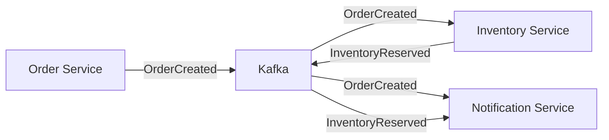

# Technical Context

## Technology Stack

### Core Technologies
- **.NET 9** - Latest version of Microsoft's development platform
- **ASP.NET Core** - Cross-platform web framework
- **Entity Framework Core** - Object-relational mapping (ORM)
- **C# 12** - Programming language with latest features

### Infrastructure & Message Broker
- **Apache Kafka** - Distributed event streaming platform
- **Zookeeper** - Coordination service for Kafka
- **PostgreSQL** - Open-source relational database
- **Docker & Docker Compose** - Containerization and orchestration

### Development & API Tools
- **Swagger/OpenAPI** - API documentation and testing
- **PowerShell** - Automation and scripting
- **Visual Studio/VS Code** - Development environment

## Architecture Patterns

### Event-Driven Architecture
- **Publisher-Subscriber Pattern**: Services publish events without knowing consumers
- **Message Broker Pattern**: Kafka acts as intermediary for all service communication
- **Eventual Consistency**: Data consistency achieved through event propagation
- **Saga Pattern**: Distributed transactions managed through event choreography

### Microservices Patterns
- **Service Isolation**: Each service has its own database and deployment
- **API Gateway Pattern**: Potential for future implementation
- **Circuit Breaker**: Error handling for resilient communication
- **Health Check**: Service monitoring and status reporting

## Data Flow Architecture

## Database Strategy
- **Database per Service**: Each microservice owns its data
- **PostgreSQL**: Consistent database engine across all services
- **Entity Framework**: Code-first approach with migrations
- **Connection Pooling**: Efficient database resource management

## Current Implementation Status

### Working Components
- ✅ REST API endpoints with Swagger documentation
- ✅ Database persistence with Entity Framework
- ✅ Event publishing infrastructure
- ✅ Docker containerization
- ✅ Service health checks
- ✅ Comprehensive logging

### Simulated Components
- ⚠️ Kafka consumers (currently in simulation mode)
- ⚠️ Actual message broker connectivity
- ⚠️ Real-time event processing

### Integration Points
- **Configuration Management**: appsettings.json for each service
- **Dependency Injection**: Built-in .NET DI container
- **Error Handling**: Global exception handling
- **Serialization**: System.Text.Json for message formatting

## Development Workflow
1. **Local Development**: Run services individually with shared Kafka
2. **Docker Development**: Full stack in containers
3. **Testing**: PowerShell scripts for end-to-end scenarios
4. **Monitoring**: Kafka UI for message inspection
